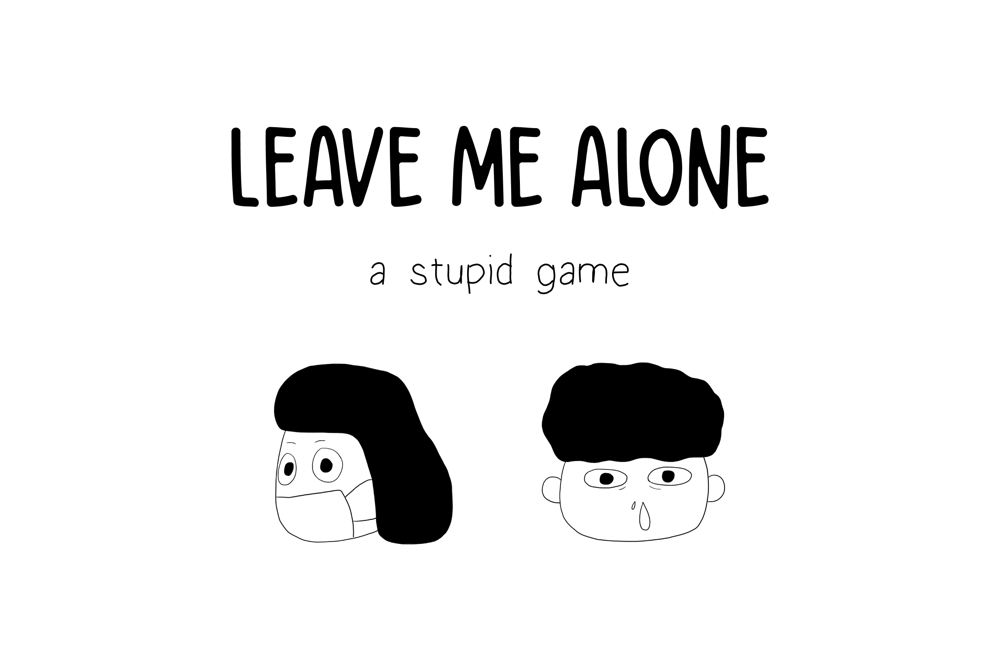

# Leave Me Alone

_(iOS, Android, Web, Windows, Linux Supported)_

---
## Concept Story
During this worldwide pandemic, we are constantly reminded to wear our masks and adhere to 1.5m social distance wherever we go. Inspired by this, we've decided to gamify this daily routine where users can help our characters maintain social distancing and receive masks. In doing so, we hope to lighten the mood regarding the current situation and remind everyone that we can overcome COVID-19 together.

---
## Getting Started
To run the project
```sh
flutter run -d $target_device
```
---
## How to Play
Separate the characters in games with the use of 1.5m distancing block. Arrow Keys ⬆️⬇️⬅️➡️ , Swiping and Tapping Gesture are supported to control the blocks. To Win the game, move the characters and the distancing block to make sure each character doesn't have any other person on his/her top and bottom, left and right (There is more than one way to win the game 🤫). For users who are up for a challenge, try and win with the least steps possible. And don’t forget to tell others to leave you alone when you are playing.

---
## License 
[MIT](./LICENSE)